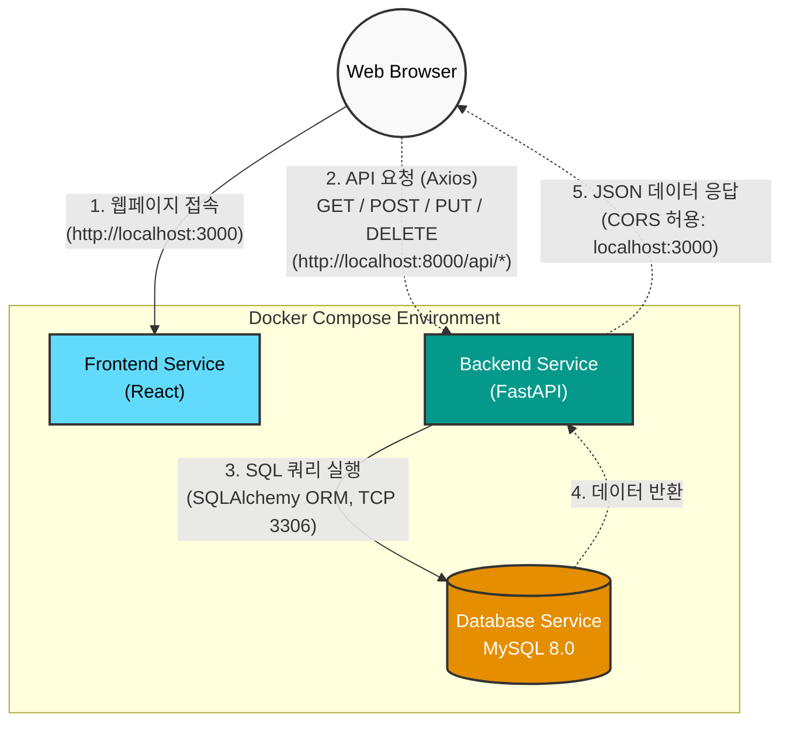
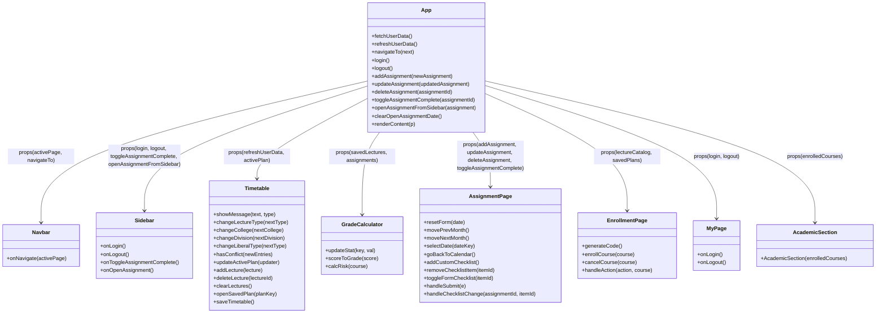

# 프로젝트 아키텍처 (통신 흐름)

분석된 `docker-compose.yml`, `main.py`, `App.js` 설정 코드를 바탕으로 구성한 프론트엔드, 백엔드, 데이터베이스 간의 통신 흐름 아키텍처 다이어그램입니다.

### 아키텍처 상세 설명

1. **Frontend (`web` 서비스)** 
   * **환경**: React 기반 (포트 `3000`)
   * **역할**: 클라이언트에게 UI를 렌더링하고 사용자 입력을 받습니다. 내부적으로 `Axios` 라이브러리를 사용하여 백엔드 서버(`API_BASE_URL: http://localhost:8000`)에 RESTful API를 호출합니다.

2. **Backend (`backend` 서비스)**
   * **환경**: Python FastAPI 기반 (포트 `8000`)
   * **역할**: 프론트엔드의 요청을 받아 비즈니스 로직을 처리합니다. `main.py`에 구성된 CORS 미들웨어를 통해 `http://localhost:3000` (프론트엔드)에서 오는 교차 출처 요청을 안전하게 허용합니다. 요청 처리를 위해 `SQLAlchemy` ORM을 사용하여 DB와 소통합니다.

3. **Database (`db` 서비스)**
   * **환경**: MySQL 8.0 (포트 `3306`)
   * **역할**: `docker-compose.yml`에서 설정된 `univ_db` 데이터베이스에 과제, 시간표, 사용자 정보 등을 영구적으로 저장합니다. 백엔드가 DB 헬스체크를 통과한 후 연결되어 테이블 생성 및 시드 데이터 주입을 진행합니다.
