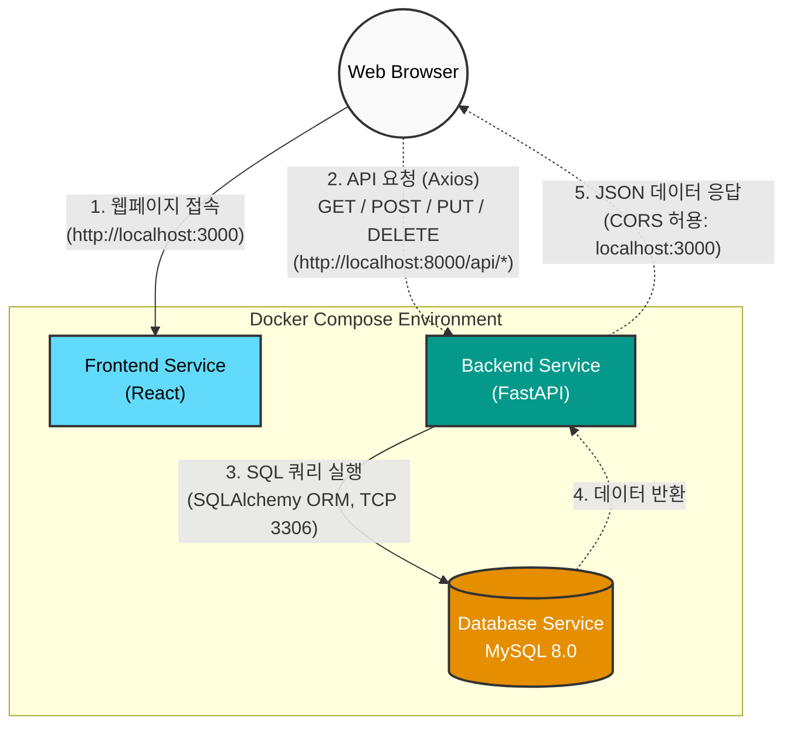

# 프로젝트 아키텍처 (통신 흐름)

분석된 `docker-compose.yml`, `main.py`, `App.js` 설정 코드를 바탕으로 구성한 프론트엔드, 백엔드, 데이터베이스 간의 통신 흐름 아키텍처 다이어그램입니다.

---

## 웹페이지 기능 설명

### 1. 메인 페이지 (시간표)
- **시간표 관리**: 전공/교양 강의를 검색하고 시간표에 추가/삭제할 수 있습니다.
- **시간 충돌 검사**: 강의 추가 시 기존 시간표와 겹치는지 자동으로 검증합니다.
- **계획 저장**: 1안/2안으로 시간표를 나눠 저장하고 비교할 수 있습니다.
- **학술 정보 캐러셀**: 등록된 과목과 관련된 학술 논문 정보를 자동으로 순환 표시합니다.

### 2. 학점 계산기
- **위험도 분석**: 과목별 출석률, 과제 제출률, 예상 시험 점수를 종합하여 위험 점수와 예상 학점을 계산합니다.
- **과제 연동**: 시간표에 등록된 과목의 과제 제출 현황을 자동으로 반영합니다.

### 3. 과제 관리
- **캘린더 뷰**: 월별 캘린더에서 과제 마감일을 한눈에 확인할 수 있습니다.
- **과제 상세 관리**: 과제별로 제목, 마감일/시간, 우선순위, 체크리스트, 메모를 관리합니다.
- **진행률 및 위험도 표시**: D-day와 체크리스트 수행률을 기반으로 안전/주의/긴급 상태를 시각화합니다.

### 4. 수강신청 시뮬레이션
- **연습 모드**: 실제 수강신청 환경을 시뮬레이션하여 연습할 수 있습니다.
- **보안 문자 검증**: 매 행동마다 보안 문자를 입력해야 하는 실제 환경을 재현합니다.

### 5. 마이페이지
- **사용자 정보 표시**: 이름, 이메일, 학번, 학과, 학년, 학기 정보를 확인합니다.
- **학년 변경**: 드롭다운으로 학년을 변경하고 서버에 저장합니다.

### 6. 사이드바
- **과제 알림**: 미제출 과제를 마감일 순으로 정렬하여 표시합니다.
- **빠른 이동**: 과제 클릭 시 해당 날짜의 과제 상세 화면으로 바로 이동합니다.

### 7. 로그인/회원가입
- **세션 유지**: 로그인 상태가 localStorage에 저장되어 브라우저 새로고침 시에도 유지됩니다.
- **입력 보호**: 모달 외부 클릭 시 확인 메시지를 띄워 실수로 입력 데이터가 사라지는 것을 방지합니다.

---

## 기술 스택

| 구분 | 기술 |
|------|------|
| **Frontend** | React 19, Axios |
| **Backend** | Python, FastAPI, SQLAlchemy |
| **Database** | MySQL 8.0 |
| **Infrastructure** | Docker, Docker Compose |
